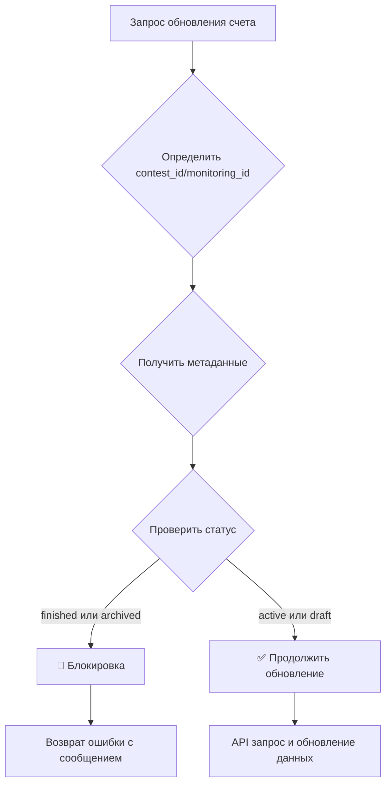

# 🚦 Блокировка обновлений завершенных конкурсов

## Описание функции

Реализована централизованная система блокировки обновления счетов для конкурсов и мониторингов, находящихся в завершенном или архивном состоянии.

## 🎯 Цель

Предотвратить ненужные API-запросы и обновления данных для завершенных конкурсов, оптимизировав работу системы и исключив создание очередей обновления для неактивных конкурсов.

## 📋 Что блокируется

### Для конкурсов:
- ✅ **Автоматическое обновление** - уже было реализовано
- ✅ **Ручное массовое обновление** через админку  
- ✅ **Индивидуальное обновление** через Ajax кнопки
- ✅ **Обновление через фронтенд** пользователями
- ✅ **Регистрация новых счетов** в завершенных конкурсах

### Для мониторингов:
- ✅ Все то же самое, что и для конкурсов

## 🔧 Технические детали

### Условия блокировки

Обновление блокируется, если выполняется любое из условий:

```php
// Для конкурсов
$contest_data['contest_status'] === 'finished' 
// ИЛИ
$contest_data['is_archived'] === '1'

// Для мониторингов  
$monitoring_data['monitoring_status'] === 'finished'
// ИЛИ
$monitoring_data['is_archived'] === '1'
```

### Измененные файлы

1. **`contest_plugin/contests/includes/class-api-handler.php`**
   - Добавлена проверка в функцию `process_trading_account()`
   - Строки 95-131

2. **`monitoring_plugin/includes/class-api-handler.php`**
   - Добавлена проверка в функцию `monitoring_process_trading_account()`
   - Строки 95-131

### Принцип работы



## 📊 Возвращаемые данные при блокировке

### Для конкурсов:
```php
[
    'success' => false,
    'message' => 'Обновление счетов невозможно - конкурс находится в завершенном состоянии',
    'contest_status' => 'finished',
    'is_archived' => '0',
    'debug_info' => 'Contest ID: 123, Status: finished, Archived: 0'
]
```

### Для мониторингов:
```php
[
    'success' => false,
    'message' => 'Обновление счетов невозможно - мониторинг находится в архивном состоянии',
    'monitoring_status' => 'active',
    'is_archived' => '1',
    'debug_info' => 'Monitoring ID: 456, Status: active, Archived: 1'
]
```

## 🧪 Тестирование

### Автоматический тест
Запустите файл `test-contest-status-block.php` в корне сайта:
```
https://your-site.com/test-contest-status-block.php
```

### Ручное тестирование

1. **Админка WordPress:**
   - Перейдите в раздел счетов конкурса
   - Выберите счета завершенного конкурса
   - Попробуйте массовое обновление
   - Ожидаемый результат: блокировка с сообщением

2. **Фронтенд:**
   - Найдите счет в завершенном конкурсе
   - Нажмите "Обновить данные"
   - Ожидаемый результат: сообщение об ошибке

3. **Ajax запросы:**
   - Проверьте в DevTools ответы на Ajax запросы
   - При блокировке в ответе будет `success: false`

## 📝 Логирование

Все блокировки записываются в логи с подробной информацией:

```php
ft_api_log([
    'contest_id' => 123,
    'contest_status' => 'finished',
    'is_archived' => '0',
    'account_id' => 456,
    'is_new' => false
], "Блокировка обновления счета в завершенном конкурсе", "info");
```

## ⚠️ Важные замечания

1. **Централизованность:** Блокировка работает на уровне API Handler, что гарантирует срабатывание для всех типов обновлений

2. **Обратная совместимость:** Функция не нарушает существующий код, только добавляет дополнительную проверку

3. **Производительность:** Минимальное влияние на производительность - проверка выполняется только при наличии contest_id/monitoring_id

4. **Автообновление:** Для автоматического обновления блокировка уже была реализована в `Account_Updater::run_auto_update()`

## 🚀 Дальнейшие улучшения

1. **Кэширование статусов** конкурсов для уменьшения количества запросов к базе данных
2. **Конфигурируемость** - возможность включать/отключать блокировку через настройки
3. **Детализированные сообщения** в зависимости от типа блокировки (завершен/архивный)
4. **Статистика блокировок** для мониторинга эффективности

## 🔍 Версионирование

- **v1.0** - Первоначальная реализация централизованной блокировки
- **Дата:** 2024-12-19
- **Автор:** AI Assistant

---

**Примечание:** После завершения тестирования удалите файл `test-contest-status-block.php` из корня сайта для безопасности. 