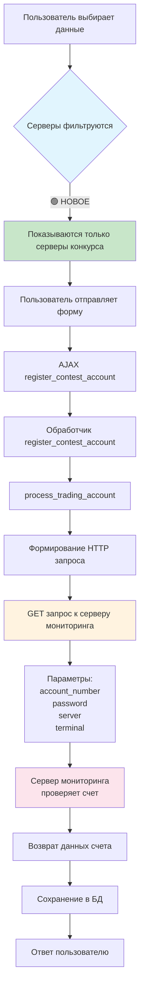

# Документация плагина Trading Contest

## Общее описание

Trading Contest - это WordPress плагин для организации и проведения торговых конкурсов. Плагин позволяет пользователям регистрировать свои торговые счета для участия в конкурсах, отслеживать их показатели и ранжировать участников по результативности.

## Архитектура проекта

### Структура директорий

```
contests/
├── admin/                    # Административная часть плагина
│   ├── css/                  # CSS файлы для админ-панели
│   │   └── admin.css         # Основные стили для админки
│   ├── images/               # Изображения для админки
│   │   └── loading.gif       # Индикатор загрузки
│   ├── js/                   # JavaScript файлы для админ-панели
│   │   ├── account-chart.js  # Скрипт для отображения графика счета
│   │   └── admin.js          # Основной скрипт админки
│   ├── views/                # Шаблоны для админ-панели
│   │   └── history-table.php # Шаблон для таблицы истории
│   ├── class-accounts-list-table.php # Таблица списка аккаунтов
│   ├── class-admin-menu.php  # Меню админ-панели
│   ├── class-admin-pages.php # Страницы админ-панели
│   └── class-settings-page.php # Страница настроек
├── frontend/                 # Фронтенд часть плагина
│   ├── css/                  # CSS для публичной части
│   │   └── frontend.css      # Основные стили фронтенда
│   ├── js/                   # JavaScript для публичной части
│   │   └── frontend.js       # Основной скрипт фронтенда
│   └── templates/            # Шаблоны для фронтенда
│       └── contests-list.php # Шаблон списка конкурсов
├── includes/                 # Основные классы и функции плагина
│   ├── admin-metaboxes.php   # Метабоксы для админки
│   ├── class-account-ajax-handlers.php # Обработчики AJAX для счетов
│   ├── class-account-chart-data.php    # Данные для графиков счетов
│   ├── class-account-history.php       # История счетов
│   ├── class-account-updater.php       # Обновление данных счетов
│   ├── class-accounts.php              # Работа со счетами
│   ├── class-api-handler.php           # Обработчик API
│   ├── class-cron-manager.php          # Менеджер заданий Cron
│   ├── class-installer.php             # Установщик плагина
│   ├── class-orders.php                # Работа с ордерами
│   ├── class-settings-page.php         # Настройки
│   └── front-templates.php             # Функции шаблонов фронтенда
├── public/                   # Публичная часть плагина
│   ├── css/                  # CSS для публичной части
│   ├── js/                   # JavaScript для публичной части
│   │   └── contest-scripts.js # Скрипты для работы с конкурсами
│   ├── class-contest-ajax.php # AJAX для публичной части
│   └── class-contest-public.php # Основной класс публичной части
├── templates/                # Шаблоны для отображения на фронтенде
│   ├── parts/                # Части шаблонов
│   │   └── registration-form.php  # Форма регистрации
│   ├── archive-contests.php  # Архивная страница конкурсов
│   ├── single-account.php    # Страница отдельного счета
│   └── single-contest.php    # Страница отдельного конкурса
├── test-ajax.php             # Тестовый файл для AJAX
└── ft-trader-contest.php     # Основной файл плагина
```

### Документация и лог разработки

```
/
├── MEMORY_INDEX.md           # Индекс файлов памяти проекта
└── planning/                 # Директория для планирования и документации
    └── BUG_FIXES_LOG.md      # Лог исправлений ошибок
```

### База данных

Плагин использует следующие таблицы:

- `wp_contest_members` - Информация об участниках и их счетах
- `wp_contest_members_orders` - Текущие открытые ордера
- `wp_contest_members_order_history` - История закрытых ордеров
- `wp_contest_members_history` - История изменений различных полей счета

## Класс Account_Trading_Metrics v1.0.4

Класс `Account_Trading_Metrics` предназначен для расчета торговых метрик и статистики счетов участников конкурса.

### Основные методы

```php
/**
 * Рассчитывает профит фактор для счета
 * 
 * @param int $account_id ID счета
 * @return float Profit Factor
 */
public function calculate_profit_factor($account_id) { ... }

/**
 * Рассчитывает среднюю продолжительность сделки
 * 
 * @param int $account_id ID счета
 * @return string Форматированная продолжительность
 */
public function calculate_avg_trade_duration($account_id) { ... }

/**
 * Рассчитывает все торговые метрики для счета
 * 
 * @param int $account_id ID счета
 * @return array Массив с торговыми метриками
 */
public function calculate_metrics($account_id) { ... }

/**
 * Рассчитывает статистику по инструментам для счета v1.0.2
 * 
 * @param int $account_id ID счета
 * @return array Массив со статистикой по инструментам
 */
public function calculate_symbols_statistics($account_id) { ... }
```

### Рассчитываемые метрики

Класс рассчитывает следующие метрики для торговых счетов:

- **Профит фактор** - отношение общей прибыли к общему убытку
- **Процент выигрышных сделок** (Win Rate) - отношение выигрышных сделок к общему числу сделок
- **Средняя продолжительность сделки** - среднее время между открытием и закрытием сделки
- **Риск/Прибыль** (Risk/Reward Ratio) - отношение средней прибыли к среднему убытку
- **Статистика по инструментам** - детальная статистика по каждому торговому инструменту

### Статистика торговых инструментов

Для каждого торгового инструмента рассчитывается:

- Общее количество сделок
- Общий объем сделок (в лотах)
- Общая прибыль/убыток
- Количество выигрышных/проигрышных сделок
- Валовая прибыль/убыток
- Средняя продолжительность сделки
- Статистика по направлениям (BUY/SELL)

## Функциональность графиков

### Общий принцип работы графиков

Графики в плагине отображают историю изменения баланса и equity (средств) счета. Данные собираются из различных источников: история сделок, обновления через API, и история изменений различных полей.

### Вычисление баланса

Баланс строится на основе истории закрытых ордеров:

1. Получение данных о сделках из таблицы `wp_contest_members_order_history`
2. Последовательное сложение profit/loss каждой сделки начиная с начального депозита
3. Добавление текущего значения баланса, если оно отличается от рассчитанного

### Вычисление Equity (Средств)

Equity (средства) - это баланс плюс нереализованная прибыль/убыток по открытым позициям. В графике:

1. История значений equity берется из таблицы `wp_contest_members_history` где `field_name = 'i_equi'`
2. Последняя точка equity всегда берется из текущего значения в таблице `wp_contest_members`, поле `equity`

#### Алгоритм расчета последней точки Equity

Последняя точка графика equity является синтетической и берется напрямую из базы данных:

```php
// Добавляем текущее значение equity, если оно отличается от последней точки
$last_equity_point = end($equity_points);
if (!$last_equity_point || $last_equity_point['equity'] != $account_data->equity) {
   $equity_points[] = [
      'timestamp' => strtotime($account_data->last_update),
      'date' => $account_data->last_update,
      'equity' => (float)$account_data->equity,
      'is_equity_only' => true
   ];
}
```

Это значение обновляется при каждой синхронизации данных счета с торговым сервером через API и отражает текущий баланс плюс плавающую прибыль/убыток.

### Периоды графика

График поддерживает различные периоды отображения:
- День
- Неделя
- Месяц 
- Год
- Все время

Для каждого периода подбирается оптимальный интервал агрегации и форматирование дат.

## Техническая документация JavaScript

### Объект AccountChart

Модуль `account-chart.js` реализует объект `AccountChart`, который управляет всей функциональностью графика:

```javascript
var AccountChart = {
    chart: null,              // Экземпляр графика Chart.js
    accountId: 0,             // ID счета для отображения
    currentPeriod: 'week',    // Текущий период графика
    initialized: false,       // Флаг инициализации
    debug: false,             // Флаг режима отладки
    
    // Основные методы:
    init: function() {...},         // Инициализация графика
    initEvents: function() {...},   // Инициализация обработчиков событий
    loadChartData: function() {...},// Загрузка данных с сервера
    renderChart: function() {...},  // Отрисовка графика
    updateLegend: function() {...}, // Обновление легенды
    formatDate: function() {...},   // Форматирование дат
    updateChartDataLog: function() {...} // Обновление лога данных
};
```

### Инициализация графика

```javascript
init: function () {
    // Проверка инициализации
    if (this.initialized) return;
    
    // Находим элемент графика
    if ($('#accountChart').length === 0) return;
    
    // Получаем ID счета
    this.accountId = $('#accountChart').data('account-id');
    
    if (!this.accountId) return;
    
    // Инициализируем обработчики и загружаем данные
    this.initEvents();
    this.loadChartData('week');
    
    // Отмечаем успешную инициализацию
    this.initialized = true;
}
```

### Загрузка и отображение данных

```javascript
// Загрузка данных
loadChartData: function (period) {
    this.currentPeriod = period;
    $('#chart-loading').removeClass('hidden');
    
    // Уничтожаем старый график если есть
    if (this.chart) {
        this.chart.destroy();
        this.chart = null;
    }
    
    // AJAX запрос на сервер
    $.ajax({
        url: ftAccountChart.ajaxurl,
        type: 'POST',
        data: {
            action: 'get_account_chart_data',
            account_id: this.accountId,
            period: period,
            nonce: ftAccountChart.nonce
        },
        success: function (response) {
            if (response.success) {
                self.renderChart(response.data);
            }
        }
    });
}
```

### Обработка данных графика

```javascript
renderChart: function (data) {
    $('#chart-loading').addClass('hidden');
    
    // Проверка наличия данных
    if (!data || !data.labels || data.labels.length === 0) {
        $('#chart-loading').text(ftAccountChart.i18n.noData).removeClass('hidden');
        return;
    }
    
    // Подготовка данных
    var datasets = [];
    
    // Данные баланса
    datasets.push({
        label: 'Баланс',
        data: balanceValues,
        borderColor: '#4285f4',
        backgroundColor: 'rgba(66, 133, 244, 0.1)',
        borderWidth: 2,
        fill: false,
        tension: 0.1,
        pointRadius: validLabels.length > 50 ? 0 : 2,
        pointHoverRadius: 5,
        spanGaps: true
    });
    
    // Данные equity
    if (hasEquityData) {
        datasets.push({
            label: 'Средства',
            data: equityValues,
            borderColor: '#34a853',
            backgroundColor: 'rgba(52, 168, 83, 0.1)',
            borderWidth: 2,
            fill: false,
            tension: 0.1,
            pointRadius: validLabels.length > 50 ? 0 : 2,
            pointHoverRadius: 5,
            borderDash: [5, 5],
            spanGaps: true
        });
    }
    
    // Создание графика с библиотекой Chart.js
    this.chart = new Chart(ctx, {
        type: 'line',
        data: {
            labels: validLabels,
            datasets: datasets
        },
        options: options // Различные настройки
    });
    
    // Обновляем легенду и лог данных
    this.updateLegend(data);
}
```

### Отображение лога значений

```javascript
updateChartDataLog: function (data) {
    var $chartDataLog = $('#chartDataLog');
    if ($chartDataLog.length === 0) return;
    
    // Очищаем контейнер
    $chartDataLog.empty();
    
    // Создаем таблицу с данными
    var htmlContent = '<table style="width: 100%; border-collapse: collapse;">';
    htmlContent += '<thead><tr>...</tr></thead><tbody>';
    
    // Добавляем строки с данными
    if (data.labels && data.labels.length > 0) {
        for (var i = 0; i < data.labels.length; i++) {
            var formattedDate = this.formatDate(data.labels[i], this.currentPeriod);
            var balanceValue = /* ... */ 
            var equityValue = /* ... */
            
            htmlContent += '<tr>...</tr>';
        }
    }
    
    htmlContent += '</tbody></table>';
    $chartDataLog.html(htmlContent);
}
```

## AJAX запросы

### Получение данных для графика

Данные графика загружаются через AJAX запрос `get_account_chart_data`:

```javascript
$.ajax({
    url: ftAccountChart.ajaxurl,
    type: 'POST',
    data: {
        action: 'get_account_chart_data',
        account_id: accountId,
        period: period,
        nonce: ftAccountChart.nonce
    },
    success: function (response) {
        if (response.success) {
            // Отрисовка графика
        }
    }
});
```

Сервер отвечает объектом с данными:
```json
{
  "labels": ["2023-01-01", "2023-01-02", ...],
  "balance": [{"y": 10000}, {"y": 10050}, ...],
  "equity": [{"y": 10000}, {"y": 10070}, ...],
  "current_balance": 10500,
  "current_equity": 10650
}
```

## API-интеграция и синхронизация данных

### Общий принцип работы API

Плагин взаимодействует с MT4/MT5 серверами через специальный API-шлюз. Процесс включает:

1. Получение данных со счета (баланс, equity, открытые позиции)
2. Обновление данных в БД
3. Сохранение истории изменений определенных полей

### Расчет текущего Equity

Значение equity (средств) рассчитывается на стороне MT4/MT5 сервера и отправляется через API. Формула:

```
Equity = Баланс + Нереализованная прибыль/убыток
```

где нереализованная прибыль/убыток - это сумма текущих профитов/лоссов по всем открытым позициям, рассчитанная по текущим рыночным ценам.

### Процесс синхронизации данных

1. **Авто-синхронизация**:
   - Запускается по расписанию через WP Cron
   - Частота настраивается в админке (по умолчанию каждые 15 минут)
   - Проходит по всем активным счетам и обновляет их данные

2. **Ручная синхронизация**:
   - Инициируется пользователем через кнопку "Обновить данные счета"
   - AJAX-запрос отправляется на эндпоинт `update_contest_account_data`
   - При успешном обновлении страница перезагружается с новыми данными

### Сохранение истории изменений

Для значений equity и других важных параметров ведется история изменений:

1. При каждом обновлении проверяется, изменилось ли значение
2. Если значение изменилось, новое значение сохраняется в `wp_contest_members_history`
3. Эти исторические данные затем используются для построения графика

## Лог значений графика

Для анализа данных, под графиком добавлена секция с логом всех значений:

1. Секция включает все точки данных, используемые для построения графика
2. Для каждой точки отображается:
   - Дата/время (форматированная и исходная)
   - Значение баланса
   - Значение equity (средств)
3. Лог по умолчанию скрыт и отображается при нажатии кнопки

## Примечания по разработке

### Обновление данных счета

Данные счетов обновляются:
1. Автоматически через крон-задачи
2. Вручную при нажатии кнопки "Обновить данные счета"
3. Для администраторов доступна функция "Удалить сделки", которая очищает историю транзакций и сбрасывает поле last_history_time, что приводит к полной загрузке истории сделок при следующем обновлении данных

### Особенности отображения графика

- Для больших наборов данных применяется горизонтальная прокрутка
- При наведении на точку показывается всплывающая подсказка с точными значениями
- Легенда отображает текущие значения баланса и equity

### Планы на будущее

- Добавление возможности сравнения счетов на одном графике
- Расширенные индикаторы производительности (Drawdown, Sharpe Ratio, и т.д.)
- Экспорт данных графика в CSV/Excel 

### Очищаем БД от нулей 

-- Удаляем записи с нулевыми значениями для финансовых полей
DELETE FROM wp_contest_members_history 
WHERE field_name IN ('i_bal', 'i_equi', 'i_marg', 'i_prof') 
AND new_value = '0' 
AND error_description IS NULL;

-- Удаляем записи с нулевыми процентными изменениями
DELETE FROM wp_contest_members_history 
WHERE change_percent = 0 
AND error_description IS NULL;

## Лог исправлений ошибок

Для отслеживания всех исправлений ошибок в проекте используется специальный лог-файл `planning/BUG_FIXES_LOG.md`. Каждое исправление документируется с указанием даты, краткого названия бага, объяснения что и где было исправлено, а также автора исправления.

### Формат записи

Каждое исправление ошибки записывается в следующем формате:

| Дата | Название исправления | Что исправлено и где | Автор |
|------|----------------------|---------------------|-------|
| YYYY-MM-DD | Краткое название бага | Одностроковое объяснение исправления и его местоположения | Имя автора |

### Пример записи

| Дата | Название исправления | Что исправлено и где | Автор |
|------|----------------------|---------------------|-------|
| 2025-04-22 | Нулевые значения в БД | Добавлены отладочные значения -1/-2 для выявления причин появления нулей в class-api-handler.php и class-account-history.php | Roman Tarusov |

## Управление кешированием

### Изменения в версии 1.1.0

1. **Предотвращение кеширования для анонимных пользователей**
   - Добавлены заголовки для предотвращения кеширования
   - Реализовано автоматическое обновление данных
   - Добавлена анимация при обновлении данных

2. **Новые файлы**
   - `public/js/frontend.js` - JavaScript для управления обновлением данных
   - `public/css/frontend.css` - Стили для страницы конкурса

3. **Изменения в существующих файлах**
   - `templates/single-contest.php` - Добавлено управление кешированием
   - `public/class-contest-ajax.php` - Обновлен AJAX-обработчик
   - `ft-trader-contest.php` - Обновлено версионирование скриптов

4. **Настройки обновления**
   - Интервал обновления: 60 секунд
   - Обновление только для анонимных пользователей
   - Анимация при обновлении данных

## Обновление интерфейса

### Изменения блока призовых мест в версии 1.2.0

1. **Перемещение призового блока**
   - Перенесен блок призовых мест из сайдбара в основной контент под описание конкурса
   - Разработан новый привлекательный дизайн с карточками для призовых мест

2. **Улучшения дизайна**
   - Добавлена сетка карточек для визуального разделения мест
   - Специальная стилизация для топ-3 мест (🏆 1 место, 🥈 2 место, 🥉 3 место)
   - Добавлены анимации и эффекты при наведении курсора

3. **Поддержка различных форматов данных**
   - Обеспечена поддержка нового формата данных (массив `prizes` из мета-данных)
   - Сохранена обратная совместимость со старым форматом (текстовое поле `prize_places`)
   - Улучшена парсинг-логика для текстового формата

4. **Оптимизации**
   - Адаптивный дизайн для мобильных устройств
   - Более структурированный и понятный код
   - Улучшена семантика и доступность HTML

### Секция "Топ 5 участников" в версии 1.3.0

1. **Добавлена новая секция в сайдбар**
   - Отображение лидеров конкурса в компактном и информативном виде
   - Размещение секции после блока "Участие в конкурсе"
   - Отображение до 5 лучших участников с возможностью перехода к полному списку

2. **Информация по каждому участнику**
   - Ранг участника с визуальным выделением топ-3 позиций (цветовая кодировка)
   - Имя трейдера и номер счета
   - Текущая прибыль в абсолютном выражении и в процентах
   - Индикаторы прибыли/убытка с цветовым выделением

3. **Интерактивные элементы**
   - Каждая карточка участника является ссылкой на страницу детальной статистики
   - Визуальный эффект при наведении на карточку
   - Ссылка "Посмотреть всех участников" с переходом к таблице всех участников

4. **Дизайн**
   - Минималистичный стиль с акцентом на ключевую информацию
   - Визуальное ранжирование участников
   - Компактное отображение для экономии пространства на странице

### Секция "Статистика конкурса" в версии 1.4.0

1. **Добавлена аналитическая секция с ключевыми показателями**
   - Расположение под блоком призовых мест
   - Визуализация общей картины конкурса
   - Четыре основных показателя в удобном сетчатом расположении

2. **Карточки статистики**
   - **Трейдеры**: Общее количество участников с разбивкой на прибыльных и убыточных
   - **Общий P&L**: Суммарная прибыль/убыток с разбивкой на заработанную и потерянную суммы
   - **Всего сделок**: Количество сделок в конкурсе с распределением на покупки/продажи
   - **Эффективность**: Win rate участников с индикацией качества торговли

3. **Визуальные элементы**
   - Прогресс-бары для наглядного отображения соотношений
   - Цветовая кодировка для быстрого визуального анализа (зеленый - положительное, красный - отрицательное)
   - Индикаторы трендов для понимания динамики изменений

4. **Анимация и интерактивность**
   - Анимированное появление данных при загрузке страницы
   - Счетчики с анимацией для привлечения внимания к данным
   - Подсветка обновляемых данных при получении новой информации
   - Сохранение предыдущих значений для анимации изменений

5. **Техническая реализация**
   - Расчет статистики на сервере на основе данных участников
   - AJAX-обновление данных в реальном времени
   - Адаптивный дизайн для различных устройств
   - Кросс-браузерная совместимость анимаций

## Функциональность копирования конкурса

Плагин предоставляет возможность копирования существующих конкурсов, что позволяет создавать новые конкурсы на основе уже существующих, не заполняя все поля заново.

### Описание функционала

1. **Добавление кнопки "Копировать"**
   - Кнопка "Копировать" добавляется в список действий для каждого конкурса в админ-панели WordPress
   - Размещается после кнопки "Свойства" и перед "Удалить" и "Перейти"

2. **Процесс копирования**
   - При клике на кнопку "Копировать" создается дубликат конкурса
   - Новый конкурс создается в статусе "Черновик"
   - К названию нового конкурса добавляется суффикс "(копия)"
   - Копируются все метаданные конкурса, включая:
     - Основные данные
     - Настройки
     - Условия
     - Призовые места
   - Копируется миниатюра (изображение) конкурса, если она была установлена

3. **Безопасность**
   - Проверяются права пользователя на редактирование записей
   - Используется nonce для предотвращения CSRF-атак
   - Производится валидация всех входных данных

### Использование функционала копирования

1. Перейдите на страницу списка конкурсов в админ-панели WordPress
2. Наведите курсор на нужный конкурс для отображения списка действий
3. Нажмите "Копировать" для создания дубликата конкурса
4. Вы будете автоматически перенаправлены на страницу редактирования нового конкурса
5. Внесите необходимые изменения и опубликуйте новый конкурс

### Техническая реализация

Функциональность реализована с помощью двух основных функций:

- `fttradingapi_add_duplicate_contest_action()` - добавляет кнопку "Копировать" в список действий
- `fttradingapi_handle_duplicate_contest()` - обрабатывает запрос на копирование и создает новый конкурс

## Проверка условий дисквалификации

Система поддерживает автоматическую проверку условий дисквалификации участников конкурса. Проверки осуществляются в следующих случаях:

1. При первоначальной регистрации счета в конкурсе
2. При обновлении данных счета через административный интерфейс
3. При обновлении данных счета на фронтенде пользователем
4. По расписанию через cron-задачи (если настроено)

### Поддерживаемые условия дисквалификации

1. **Начальный депозит**: проверка соответствия начального депозита требуемому значению
2. **Кредитное плечо**: проверка соответствия используемого кредитного плеча допустимым значениям
3. **Торговые инструменты**: проверка использования только разрешенных инструментов
4. **Максимальный объем**: проверка на превышение максимального суммарного объема открытых сделок
5. **Минимальное количество сделок**: проверка минимального количества совершенных сделок (применяется при завершении конкурса)
6. **Сделки до начала конкурса**: проверка наличия сделок до официальной даты начала конкурса
7. **Минимальная прибыль**: проверка достижения минимального уровня прибыли (применяется при завершении конкурса)

### Реализация проверок

Класс `Contest_Disqualification_Checker` в файле `includes/class-disqualification-checker.php` содержит все методы для проверки различных условий дисквалификации. 

### Обработка дисквалификации на фронтенде

При обновлении данных счета на фронтенде (кнопка "Обновить данные" на странице счета), система выполняет следующие действия:

1. Отправляет запрос к торговому серверу для получения актуальных данных счета
2. Обновляет данные счета в базе данных (баланс, торговое плечо, открытые позиции и т.д.)
3. Проверяет соответствие обновленных данных требованиям конкурса:
   - Проверяет кредитное плечо на соответствие разрешенным значениям
   - Проверяет используемые торговые инструменты
   - Проверяет соблюдение ограничений по объему позиций
4. В случае нарушения любого из условий:
   - Счет автоматически дисквалифицируется
   - Пользователю отображается сообщение с причиной дисквалификации
   - Статус счета обновляется на "Дисквалифицирован" с указанием причины
5. Дисквалифицированные счета не участвуют в рейтингах и не могут претендовать на призы
6. Такие счета продолжают автоматически обновляться не реже одного раза в сутки

Обработка запросов обновления счета на фронтенде выполняется методом `update_account_frontend` в классе `Contest_Public_Ajax`.

### Особенности проверки кредитного плеча

Проверка кредитного плеча при обновлении счета выполняется ПОСЛЕ получения актуальных данных с сервера, чтобы:
1. Учитывать возможные изменения на торговом сервере, которые не отражены в базе данных
2. Давать пользователям возможность обновить данные счета даже если предыдущее значение плеча не соответствовало требованиям
3. Производить дисквалификацию на основе актуальных данных с сервера

Последовательность действий при проверке плеча:
1. Пользователь нажимает "Обновить данные"
2. Система запрашивает актуальные данные с торгового сервера
3. Данные обновляются в базе данных
4. Система проверяет обновленное значение плеча на соответствие требованиям
5. Если плечо не соответствует требованиям, счет дисквалифицируется

## Статистика главной страницы конкурса

## Поля истории счета в таблице `wp_contest_members_history`

- `i_bal` - Баланс счета
- `i_equi` - Equity (Средства) счета
- `i_marg` - Margin (Маржа) счета
- `i_prof` - Profit (Прибыль) счета
- `active_orders_volume` - Объем открытых сделок (без учета отложенных ордеров) в лотах
- `leverage` - Кредитное плечо счета
- `i_ordtotal` - Общее количество ордеров
- `pass` - Пароль счета (при изменении)
- `srvMt4` - Сервер MT4/MT5
- `last_logMt4` - Последнее подключение к MT4/MT5
- `i_server` - Сервер
- `i_firma` - Брокер
- `i_fio` - Имя владельца счета
- `i_cur` - Валюта счета
- `i_dr` - Тип счета
- `connection_status` - Статус подключения

## Обновление выбора брокера и сервера

Ранее в метабоксе "Основная информация" использовались текстовые поля **servers** и **terminals**. Теперь им на смену пришла каскадная цепочка выпадающих списков:

1. **Брокер** — выбирается из справочника брокеров.
2. **Платформа** — список формируется после выбора брокера.
3. **Сервер** — заполняется после выбора платформы.

Значения выбранных списков сохраняются в мета‑полях `broker_id`, `platform_id` и `server`. Старое поле `servers` продолжает читаться для обратной совместимости, если новые данные отсутствуют.

## Система фильтрации серверов и формирование запросов к серверу мониторинга

### Обзор изменений

В рамках улучшения пользовательского опыта была реализована система фильтрации серверов в форме регистрации. Теперь пользователь видит только те серверы, которые настроены администратором для конкретного конкурса.

### Форма регистрации

**Местоположение:** `contests/templates/parts/registration-form.php`

Форма содержит следующие поля:
- **Номер счета** - торговый счет пользователя
- **Пароль счета** - инвесторский пароль для мониторинга  
- **Брокер** - выпадающий список доступных брокеров
- **Торговая платформа** - MT4/MT5 в зависимости от брокера
- **Сервер** - 🟢 НОВОЕ: фильтруется по настройкам конкурса

**Архитектурная диаграмма:** См. [диаграмму потока данных](#диаграмма-архитектуры-системы) ниже.

### Архитектура фильтрации серверов

#### 1. Настройка серверов в админке

Администратор в настройках конкурса указывает разрешенные серверы через чекбоксы:
- Данные сохраняются в meta поле `_fttradingapi_contest_data['servers']`
- Может быть массивом или строкой с адресами серверов

#### 2. Фильтрация в AJAX обработчике

**Модифицированный файл:** `contests/includes/class-brokers-platforms.php`

**Функция:** `ajax_get_broker_servers()`

Логика фильтрации:
```php
// Получаем contest_id из AJAX запроса
$contest_id = isset($_POST['contest_id']) ? intval($_POST['contest_id']) : 0;

// Получаем все серверы брокера/платформы
$servers = self::get_broker_servers($broker_id, $platform_id);

// Если указан contest_id, применяем фильтрацию
if ($contest_id > 0) {
    $contest_data = get_post_meta($contest_id, '_fttradingapi_contest_data', true);
    
    if (!empty($contest_data) && isset($contest_data['servers'])) {
        $allowed_servers = array();
        
        // Обработка разных форматов данных
        if (is_array($contest_data['servers'])) {
            $allowed_servers = $contest_data['servers'];
        } elseif (is_string($contest_data['servers'])) {
            $allowed_servers = array_filter(array_map('trim', explode("\n", $contest_data['servers'])));
        }
        
        // Фильтрация серверов
        if (!empty($allowed_servers)) {
            $servers = array_filter($servers, function($server) use ($allowed_servers) {
                return in_array($server->server_address, $allowed_servers);
            });
            $servers = array_values($servers);
        }
    }
}
```

#### 3. Обновление JavaScript запросов

**Модифицированные файлы:**
- `contests/templates/parts/registration-form.php`
- `contests/public/js/contest-scripts.js` 
- `contests/frontend/js/frontend.js`

Во всех AJAX запросах `get_broker_servers` добавлен параметр `contest_id`:

```javascript
data: {
    action: 'get_broker_servers',
    nonce: ftContestData.nonce,
    broker_id: brokerId,
    platform_id: platformId,
    contest_id: $('#contest_id').val() // НОВЫЙ параметр
}
```

### Схема формирования запроса к серверу мониторинга

#### Поток данных (после изменений)

```
1. Пользователь заполняет форму
   ↓
2. 🟢 НОВОЕ: Серверы фильтруются по настройкам конкурса
   ↓
3. Пользователь отправляет форму с данными:
   - account_number
   - password  
   - server (только из разрешенного списка)
   - terminal
   ↓
4. AJAX обработчик register_contest_account
   ↓
5. Функция process_trading_account()
   ↓
6. ⚪ НЕ ИЗМЕНИЛОСЬ: HTTP запрос к серверу мониторинга
   ↓
7. GET запрос к API:
   action=get_data&account_number=XXX&password=XXX&server=XXX&terminal=XXX
   ↓
8. Сервер мониторинга проверяет счет
   ↓
9. Возврат данных счета и сохранение в БД
```

#### Диаграмма архитектуры системы



#### Технические детали запроса к серверу мониторинга

**Файл:** `contests/includes/class-api-handler.php`

**Функция:** `process_trading_account()`

**Формирование запроса:**
```php
// Подготовка параметров
$params = [
    'action' => 'get_data',
    'account_number' => $api_params['account_number'],
    'password' => $api_params['password'],
    'server' => $api_params['server'],
    'terminal' => $api_params['terminal'],
    'last_history_time' => $api_params['last_history_time']
];

// Формирование URL
$url = $api_url . '?' . http_build_query($params);

// HTTP запрос
$response = wp_remote_get($url, ['timeout' => 30, 'sslverify' => false]);
```

#### Параметры запроса к серверу мониторинга

| Параметр | Описание | Источник |
|----------|----------|----------|
| `action` | Тип операции (всегда "get_data") | Константа |
| `account_number` | Номер торгового счета | Форма пользователя |
| `password` | Пароль счета (инвесторский) | Форма пользователя |
| `server` | Адрес торгового сервера | 🟢 Теперь из фильтрованного списка |
| `terminal` | Тип терминала (MT4/MT5) | Форма пользователя |
| `last_history_time` | Время последней синхронизации | БД или 0 для нового счета |

### Преимущества новой системы

#### 1. Безопасность
- Пользователь не может выбрать неподдерживаемый сервер
- Исключены ошибки регистрации из-за неправильного выбора сервера

#### 2. Управляемость
- Администратор полностью контролирует доступные серверы для каждого конкурса
- Возможность ограничить конкурс определенными брокерами/серверами

#### 3. Стабильность
- Система передачи данных к серверу мониторинга не изменилась
- Полная обратная совместимость с существующими процессами

### Совместимость

#### Обратная совместимость
- Если `contest_id` не передан, показываются ВСЕ серверы (старое поведение)
- Существующие формы без `contest_id` продолжают работать
- Старые AJAX запросы без `contest_id` работают без изменений

#### Файлы, затронутые изменениями
- ✅ `contests/includes/class-brokers-platforms.php` - фильтрация серверов
- ✅ `contests/templates/parts/registration-form.php` - передача contest_id
- ✅ `contests/public/js/contest-scripts.js` - передача contest_id  
- ✅ `contests/frontend/js/frontend.js` - передача contest_id
- ⚪ `contests/admin/js/admin.js` - не изменен (админка не нуждается в фильтрации)

#### Файлы, НЕ затронутые изменениями
- ⚪ `contests/public/class-contest-ajax.php` - логика регистрации
- ⚪ `contests/includes/class-api-handler.php` - запросы к серверу мониторинга
- ⚪ `contests/includes/class-api-config.php` - конфигурация API

### Диагностика и отладка

#### Логирование фильтрации серверов
Система логирует процесс фильтрации:

```php
error_log('[DEBUG] Серверы отфильтрованы для конкурса ' . $contest_id . 
         '. Разрешенные серверы: ' . json_encode($allowed_servers) . 
         '. Итоговый список: ' . json_encode($servers));
```

#### Проверка работы фильтрации
1. В админке настройте серверы для конкурса
2. В форме регистрации выберите брокер и платформу
3. Убедитесь, что список серверов содержит только настроенные
4. Проверьте логи WordPress на наличие отладочных сообщений

### Планы развития

#### Возможные улучшения
1. **Графический интерфейс для настройки серверов** - замена текстового поля на удобные чекбоксы
2. **Валидация серверов** - проверка существования сервера перед сохранением
3. **Кэширование списков серверов** - улучшение производительности
4. **Автоматическое определение доступных серверов** - синхронизация с внешними источниками

#### Техническая задолженность
- Унификация формата хранения серверов (массив vs строка)
- Добавление миграции для старых данных
- Улучшение обработки ошибок при отсутствии серверов

---

*Документация обновлена: декабрь 2024*
*Версия системы фильтрации: 1.0*
